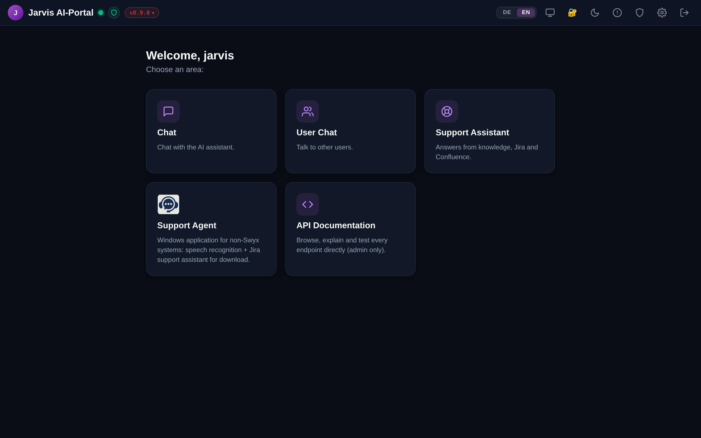
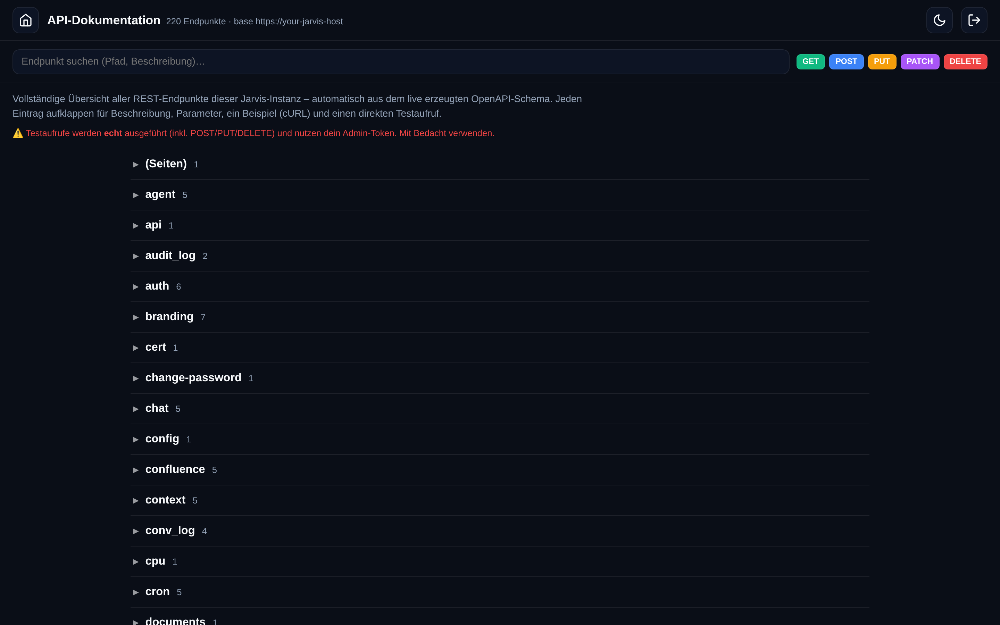
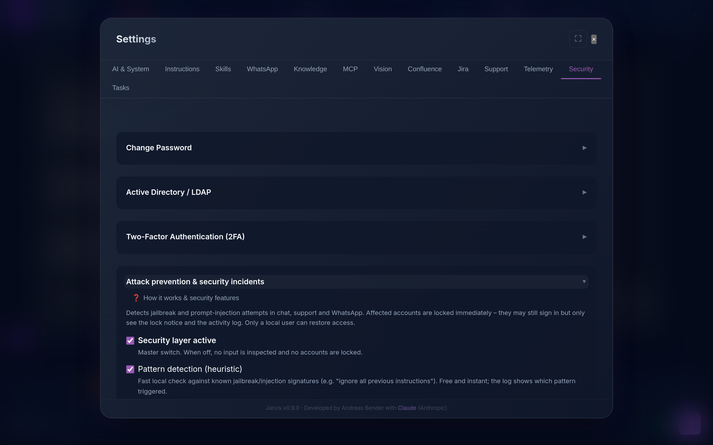
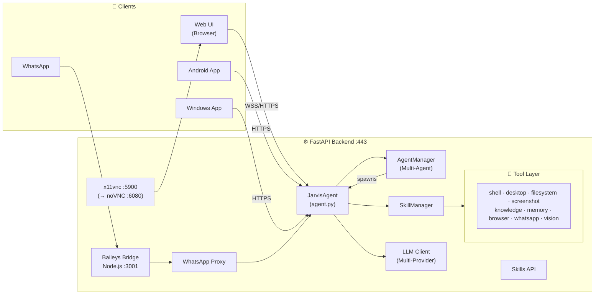

<div align="center">

# 🤖 Jarvis AI Desktop Agent

**A self-hosted, autonomous AI agent for Linux — it plans, executes, and gets real work done.**

[](https://www.python.org/)
[](LICENSE)
[](https://github.com/dev-core-busy/jarvis/releases)
[](https://www.linux.org/)
[](https://github.com/dev-core-busy/jarvis/pulls)
[](https://github.com/dev-core-busy/jarvis#openclaw-skill-ecosystem)

*Control your Linux desktop with natural language. Receive tasks via WhatsApp. Search your knowledge base. Automate everything.*

[**Live Demo**](https://jarvis-ai.info) · [**Report Bug**](https://github.com/dev-core-busy/jarvis/issues) · [**Request Feature**](https://github.com/dev-core-busy/jarvis/issues) · [**Contribute**](#contributing)

---



</div>

---

## 📋 Table of Contents

- [Overview](#overview)
- [Screenshots](#screenshots)
- [Key Features](#key-features)
- [Architecture](#architecture)
- [Tech Stack](#tech-stack)
- [Installation](#installation)
- [Configuration](#configuration)
- [Multi-User Chat](#multi-user-chat)
- [Multi-Agent System](#multi-agent-system)
- [Skill System](#skill-system)
- [WhatsApp Integration](#whatsapp-integration)
- [Knowledge Base](#knowledge-base)
- [Vision & Face Recognition](#vision--face-recognition)
- [AD/LDAP & Security](#adldap--security)
- [Multimedia Attachments](#multimedia-attachments)
- [Feedback & Self-Improvement](#feedback--self-improvement)
- [Cognitive Evolution](#cognitive-evolution)
- [Client Apps](#client-apps)
- [API Reference](#api-reference)
- [Contributing](#contributing)
- [Third-Party Licenses](#third-party-licenses)
- [License](#license)

---

## Overview

Jarvis is a **self-hosted, autonomous AI agent** that runs on a Linux server. Give it a goal in plain language — through the web chat, the built-in **Support portal**, or even **WhatsApp** — and it plans and executes: browsing the web, reading and writing files, running code, generating Office documents & diagrams, sending emails, managing your calendar. Whenever you want, you can watch it work live on the desktop via an **optional VNC view**.

```
"Find all emails from last week about Project Alpha, summarize them,
 and create a calendar event for the follow-up meeting."
```

Jarvis handles it — and because it's **multi-LLM**, **multi-user**, and wrapped in a real **security layer with sandboxed execution**, you can safely open it to a whole team.

---

## Screenshots

<div align="center">

**Interactive API console** — every REST endpoint listed, explained, with a live test caller (admin-only, `/api`):



**Security settings** — attack prevention, sandbox status & incident log under Settings → Security:



</div>

---

## Key Features

### 🖥️ Real Desktop Control (live VNC view)
Jarvis drives a real Linux desktop — launching apps, clicking, typing. Toggle the **live desktop view (noVNC)** to watch or take over at any time; screenshots feed straight back into the LLM context, so the agent sees what it's doing. No blind automation.

### 🔀 Multi-LLM Support
Switch between AI providers without restarting anything:
- **Google Gemini** (gemini-2.5-flash, gemini-2.0-flash, gemini-1.5-pro, …)
- **Anthropic Claude** (claude-opus-4, claude-sonnet-4-5, claude-haiku-4, …)
- **OpenRouter** (hundreds of models via one API)
- **Local Ollama** (llama3, mistral, qwen2.5, … — fully offline)
- Any **OpenAI-compatible** endpoint

Both native tool/function calling **and** prompt-based tool calling are supported — so even models without native tool support can use all of Jarvis's capabilities.

### 🤖 Multi-Agent System
The **main agent can spawn autonomous sub-agents** for parallel or background tasks. Each sub-agent runs independently, reports back in real-time, and appears in the sidebar. Complex multi-step workflows run in parallel without blocking the main conversation.

### 💬 Multi-User Chat
A built-in **user-to-user chat** (`/userchat`) lets all logged-in users communicate in real-time — with image galleries, audio/video players, file attachments, lightbox preview, and a forward/save context menu.

### 📎 Multimedia Attachments
Send **images, audio, video, and PDFs** directly in the Jarvis chat:
- Images are sent to the LLM for visual analysis (all providers supported)
- Audio/Video is transcribed locally via Whisper before the LLM sees it
- PDFs are extracted and injected as text context
- In-chat gallery with lightbox, right-click context menu, and mobile long-press support

### 📱 WhatsApp Agent
Send Jarvis a voice note or text message on WhatsApp, get a response back. Voice messages are transcribed via faster-whisper (runs locally, no cloud). Perfect for mobile task delegation.

### 📚 Knowledge Base
Drop PDFs, DOCX files, or plain text into watched folders. Jarvis indexes them with both **TF-IDF and ChromaDB vector search** (multilingual embeddings). Multi-folder support, automatic re-indexing on file changes.

### 🧩 Modular Skill System
Skills are self-contained Python packages that extend Jarvis with new capabilities. Install, enable, disable, and configure them through the UI without touching config files. Compatible with [OpenClaw](https://github.com/steipete/gogcli) skills.

### 👁️ Vision & Face Recognition
The optional **Vision Skill** adds real-time face recognition via dlib/face_recognition. Define per-person actions (webhook, LLM prompt, log-only) with configurable cooldown and tolerance. Works with USB cameras or IP cameras.

### 🛡️ Security Layer & Sandbox
Built to be opened to a whole team — every restriction is **enforced in code**, not just requested in the prompt (so it can't be talked around, base64-encoded around, or "learned" around):
- **Sandboxed execution** for network/domain users — shell commands run as an unprivileged OS user; file access is confined (no system/root/secret paths, symlink-escape safe)
- **Prompt-injection, jailbreak & Base64-obfuscation detection** across chat, support & WhatsApp (heuristics + LLM classifier)
- **Automatic account lockout** on repeated attack attempts, with a full, itemized violation log
- **Role-based rights** (local admins vs. network users) + sub-agents inherit the caller's confinement — no privilege escalation

### 🔐 Authentication & Access
- **Active Directory / LDAP** authentication (no domain join required)
- **2FA / TOTP** for all users
- Granular **knowledge-editor permissions** (per user or AD group)
- HTTPS with auto-generated self-signed certificates or Let's Encrypt
- Token-based auth (HMAC-SHA256, 30-day validity)

### 🌐 Google Workspace Integration
Manage Gmail, Google Calendar, and Google Drive through natural language commands — powered by the openclaw/gog CLI.

### 🤖 Browser Automation
Full browser control via CDP (Chrome DevTools Protocol) and xdotool. The agent can navigate websites, fill forms, click elements, and extract information.

### ⭐ Feedback & Self-Improvement
After every bot response, one-click **👍 👎 ❌ feedback** triggers automatic LLM analysis, generates 3–5 better alternatives, and permanently feeds learning rules into the knowledge base — no manual configuration needed.

### 🧬 Cognitive Evolution
The **Cognitive Evolution Skill** lets Jarvis improve and extend itself: it analyzes gaps, proposes new skills or code patches, validates them through a second LLM, and applies them — including hot-reloading its own engine without a service restart.

### 🧭 Role-based Portal, Chat & Support Assistant
A clean `/portal` hub routes each user to what they're allowed to use: the AI **chat**, the **user-to-user chat**, and a dedicated **Support Assistant** (`/support`) that answers from your knowledge base + Jira/Confluence with relevance-ranked sources. Admin tools (settings, VNC, security) appear only for administrators.

### 📄 Office & File Generation
Generate **Word, Excel, PowerPoint and PDF** on the fly (python-docx / openpyxl / python-pptx + LibreOffice) — including diagrams with boxes and connectors. Any generated file (or image) is delivered straight into the chat as an inline preview or a one-click download chip.

### 📊 Knowledge Groups & Bulk Tagging
Organize documents into logical groups (multi-membership), scope searches to a group, and manage everything in a **full-screen tagging matrix** — assign hundreds of documents to groups in seconds.

### 🔌 Interactive API Console
An admin-only, auto-generated **API explorer** at `/api`: every REST endpoint listed, explained, with examples and a **live test caller**. The OpenAPI schema and Swagger/ReDoc are gated behind admin auth.

### 📱 Desktop & Mobile Clients
Use Jarvis anywhere: a **native Windows app** (Go — tray, on-device speech-to-text, animated avatar, auto-update), a **native Android app** (Kotlin/Jetpack Compose — streaming chat, voice, attachments, push), and **iOS** via an installable PWA (native app on the roadmap). All share one login, chat history, and attachments. → [details](#client-apps)

---

## Architecture



### Component Overview

| Component | File | Description |
|-----------|------|-------------|
| FastAPI Server | `backend/main.py` | HTTP/WebSocket endpoints, auth, AD/LDAP, WhatsApp proxy |
| Agent Loop | `backend/agent.py` | Task execution, tool calling, LLM orchestration, multimodal |
| Agent Manager | `backend/agent.py` | Main + sub-agent lifecycle, parallel execution |
| LLM Client | `backend/llm.py` | Multi-provider abstraction (Gemini, Claude, OpenRouter, Ollama) |
| Config | `backend/config.py` | Environment + settings.json management |
| Skill Manager | `backend/skills/manager.py` | Load, enable, disable, configure skills |
| Tool Base | `backend/tools/base.py` | `BaseTool` class all tools inherit from |
| Learning | `backend/learning.py` | Feedback processing, self-improvement, knowledge indexing |
| WhatsApp Bridge | `services/whatsapp-bridge/index.js` | Baileys v7 + Express API |
| Frontend | `frontend/index.html` + `js/` | Main SPA — agent chat, settings, VNC |
| PWA Chat | `frontend/chat.html` + `js/chat.js` | Lightweight PWA chat with history persistence |
| User Chat | `frontend/userchat.html` + `js/userchat.js` | Multi-user real-time chat with media |

---

## Tech Stack

### Backend
| Technology | Version | Purpose |
|-----------|---------|---------|
| Python | 3.13 | Core runtime |
| FastAPI | latest | REST API + WebSocket server |
| uvicorn | latest | ASGI server |
| ldap3 | latest | Active Directory / LDAP authentication |
| faster-whisper | latest | Voice transcription (CPU, int8) |
| pypdf | latest | PDF text extraction |
| ChromaDB | latest | Vector database for semantic search |
| sentence-transformers | latest | Multilingual embeddings (MiniLM-L12-v2) |
| face_recognition | latest | Face detection + recognition (dlib) |

### Frontend
| Technology | Purpose |
|-----------|---------|
| Vanilla JS | Zero-dependency UI (no build system) |
| CSS Custom Properties | Dark Glassmorphism theme |
| WebSocket API | Real-time agent communication |
| noVNC | In-browser VNC client |
| Service Worker | PWA offline support |

### Desktop / System
| Technology | Purpose |
|-----------|---------|
| Xvfb | Virtual framebuffer (headless X11) |
| Openbox | Lightweight window manager |
| x11vnc | VNC server for X11 session |
| websockify | WebSocket-to-TCP proxy (noVNC bridge) |
| xdotool | X11 automation (keyboard, mouse, window management) |

### WhatsApp
| Technology | Purpose |
|-----------|---------|
| Node.js 20+ | WhatsApp bridge runtime |
| Baileys v7 | WhatsApp Web API (no official API required) |
| Express | HTTP API for bridge ↔ backend communication |

---

## Installation

### Prerequisites

```bash
# Debian/Ubuntu
sudo apt-get update && sudo apt-get install -y \
  python3.13 python3.13-venv python3-pip \
  nodejs npm \
  git \
  xvfb x11vnc openbox \
  websockify \
  xdotool \
  ffmpeg \
  cmake libboost-all-dev  # required for face_recognition (dlib)
```

> **Note:** Node.js 20+ is required. Use [nvm](https://github.com/nvm-sh/nvm) if your distro ships an older version.

### Quick Start

```bash
# 1. Clone the repository
git clone https://github.com/dev-core-busy/jarvis.git
cd jarvis

# 2. Create Python virtual environment
python3 -m venv venv
source venv/bin/activate

# 3. Install Python dependencies
pip install -r requirements.txt

# 4. Install WhatsApp bridge dependencies
cd services/whatsapp-bridge
npm install
cd ../..

# 5. Configure environment
cp .env.example .env
nano .env   # Add your API keys (see Configuration section)

# 6. Start Jarvis
./start_jarvis.sh
```

Open your browser at `https://your-server-ip` and log in with `jarvis/jarvis`.

> **Self-signed certificate:** Your browser will warn about the certificate on first visit. This is expected — accept the exception or install the certificate from Settings → SSL.

### systemd Service (Recommended for Production)

```bash
# Copy service files
sudo cp services/systemd/jarvis.service /etc/systemd/system/
sudo cp services/systemd/whatsapp-bridge.service /etc/systemd/system/

# Enable and start
sudo systemctl daemon-reload
sudo systemctl enable jarvis.service whatsapp-bridge.service
sudo systemctl start jarvis.service whatsapp-bridge.service

# Check status
sudo journalctl -u jarvis.service -f
```

### Port Overview

| Port | Service | Access |
|------|---------|--------|
| 443 | FastAPI (HTTPS) | External |
| 80 | HTTP → HTTPS Redirect | External |
| 6080 | noVNC (WSS) | External |
| 5900 | x11vnc | Local only |
| 3001 | WhatsApp Bridge | Local only |

---

## Configuration

All configuration lives in `.env` (secrets) and `data/settings.json` (UI-managed settings). Most settings can be changed at runtime via the web UI.

### `.env` Reference

```env
# ── LLM Providers ──────────────────────────────────────────────
GOOGLE_API_KEY=your_gemini_api_key
ANTHROPIC_API_KEY=your_claude_api_key
OPENROUTER_API_KEY=your_openrouter_api_key

# Local Ollama (no key needed — just set the base URL)
OLLAMA_BASE_URL=http://localhost:11434

# ── Authentication ──────────────────────────────────────────────
JARVIS_USERNAME=jarvis
JARVIS_PASSWORD=jarvis          # Change this in production!
SECRET_KEY=change-me-to-a-random-string

# ── WhatsApp ────────────────────────────────────────────────────
WA_ALLOWED_NUMBERS=+4915112345678,+4917098765432  # Comma-separated whitelist

# ── Optional ────────────────────────────────────────────────────
DISPLAY=:1                      # X11 display for desktop control
KNOWLEDGE_DIRS=/data/docs,/home/jarvis/notes  # Watched knowledge folders
```

### Switching LLM Providers

Use the Settings panel in the web UI to switch providers and models at runtime — no restart required. Multiple profiles can be saved and activated with one click.

---

## Multi-User Chat

The `/userchat` endpoint provides a **real-time P2P chat** between all users currently logged into Jarvis.

### Features
- **Live presence** — see who's online with colored status dots
- **Image gallery** — up to 4 images in a grid, tap to open fullscreen lightbox
- **Audio/Video players** — inline playback directly in the chat bubble
- **File chips** — PDF and other attachments with download links
- **Lightbox** — fullscreen image viewer with keyboard navigation (← → Esc) and save button
- **Context menu** — right-click or long-press (mobile) on any attachment: Save / Forward
- **Forward** — send any file to another online user with one tap
- **Emoji reactions** — react to any message
- **Typing indicators** and read receipts

Attachments are transferred peer-to-peer through the server — Jarvis does **not** analyze them.

---

## Multi-Agent System

Jarvis can spawn **autonomous sub-agents** that work in parallel with the main agent.

```python
# In a task, the main agent can spawn sub-agents:
# {"_spawn_agent": true, "label": "Research Agent", "task": "Find all papers about X"}
```

- Each sub-agent has access to all tools and skills
- Sub-agents appear as cards in the sidebar (purple = sub-agent, green = main)
- Real-time streaming output for every agent
- Sub-agents are fully autonomous — no interruptions or confirmations

This enables patterns like: *"Simultaneously research topic A and B, then merge the results."*

---

## Skill System

Skills extend Jarvis with new capabilities. Each skill is a self-contained Python package:

```
skills/
  my_skill/
    skill.json    # Manifest
    main.py       # Tool definitions
    requirements.txt  # Optional extra dependencies
```

### `skill.json` Structure

```json
{
  "name": "my_skill",
  "display_name": "My Awesome Skill",
  "version": "1.0.0",
  "description": "Does something awesome",
  "author": "Your Name",
  "tools": ["MyTool"],
  "config_schema": {
    "api_endpoint": {
      "type": "string",
      "description": "The API endpoint URL",
      "required": true
    }
  }
}
```

### `main.py` Structure

```python
from backend.tools.base import BaseTool

class MyTool(BaseTool):
    name = "my_tool"
    description = "Does something specific and useful"

    async def execute(self, param1: str, param2: int = 10) -> str:
        # Your implementation here
        return f"Result: {param1} with {param2}"

def get_tools(config: dict) -> list:
    return [MyTool(config=config)]
```

### Built-in Skills

| Skill | Description |
|-------|-------------|
| `browser_control` | CDP + xdotool browser automation |
| `whatsapp` | Send/receive WhatsApp messages |
| `telegram` | Telegram bot integration (receive messages, send replies) |
| `google` | Google Calendar, Drive and Gmail integration |
| `vision` | Real-time face recognition (USB/IP camera) |
| `cron` | Schedule recurring/timed tasks (cron jobs) |
| `cognitive_evolution` | Self-improving agent (analyze → propose → validate → apply) |
| `claude_bridge` | Delegate tasks to the Claude desktop app (xdotool) |
| `example_skill` | Template for new skill development |

Beyond skills, the backend also exposes an **MCP client** (`backend/mcp_client.py`) so Jarvis can connect to external Model Context Protocol servers.

### Installing a Skill

1. Place the skill folder under `skills/`
2. Enable in the web UI under Settings → Skills (hot-reload, no restart needed)

---

## 🔌 OpenClaw Skill Ecosystem

> **Jarvis is fully compatible with the [OpenClaw](https://github.com/steipete/gogcli) skill format.**

OpenClaw is a growing ecosystem of AI agent skills. Jarvis can import any OpenClaw skill package directly.

### Built-in OpenClaw Skills

| Skill | Description |
|---|---|
| `openclaw_gmail` | Full Gmail integration via gog CLI (send, read, search, manage) |
| `agent_orchestrator` | Orchestrate multiple sub-agents for complex parallel tasks |
| `agent_autonomy_kit` | Heartbeat monitoring, task queuing, autonomous operation |

### Importing an OpenClaw Skill

```bash
# Drop it into the skills/ directory
cp -r my_openclaw_skill/ skills/

# Enable in UI: Settings → Skills → toggle ON
```

---

## WhatsApp Integration

Jarvis uses [Baileys v7](https://github.com/WhiskeySockets/Baileys) to connect to WhatsApp Web — **no official API or business account required**.

### Setup

1. Start the WhatsApp bridge: `systemctl start whatsapp-bridge.service`
2. Open `https://your-server` → Settings → WhatsApp
3. Scan the QR code with your WhatsApp app
4. Add your number to `WA_ALLOWED_NUMBERS` in `.env`

### Voice Messages

Send Jarvis a voice note — it's automatically transcribed using **faster-whisper** (runs locally on CPU, no cloud):

```
You: [Voice note: "Check if there's anything urgent in my email today"]
Jarvis: "Found 3 emails marked as urgent. Here's a summary: ..."
```

### Security

Only numbers listed in `WA_ALLOWED_NUMBERS` can send tasks to Jarvis. Self-chat messages and bridge feedback loops are automatically filtered.

---

## Knowledge Base

Drop documents into watched folders and Jarvis can search them during tasks.

### Supported Formats
- PDF (`.pdf`) — full text extraction
- Word Documents (`.docx`)
- Plain Text (`.txt`, `.md`)
- Any text format

### Search Modes

| Mode | Description |
|------|-------------|
| **Auto** | Tries vector search first, falls back to TF-IDF |
| **TF-IDF** | Fast keyword-based search, works offline |
| **Vector** | Semantic search via ChromaDB + multilingual embeddings |

### Configuration

```env
KNOWLEDGE_DIRS=/home/jarvis/docs,/opt/company-wiki
```

Or configure via the Settings UI. Files are indexed automatically on change.

### Knowledge Editor Permissions

Under **Settings → Security → Active Directory**, you can restrict who is allowed to add, edit, or delete knowledge:

- **Allowed Editors** — comma-separated usernames (e.g. `mueller,schmidt`)
- **Editor Group** — AD group DN (e.g. `CN=Knowledge-Editors,OU=Groups,DC=firma,DC=local`)
- Empty = all authenticated users may edit (default)
- Local admin users are always allowed

---

## Vision & Face Recognition

The optional **Vision Skill** adds real-time face recognition using [face_recognition](https://github.com/ageitgey/face_recognition) (dlib).

### Features
- Detect and identify faces from USB camera or IP camera (RTSP/HTTP)
- Per-person configurable actions:
  - **Webhook** — HTTP POST to any URL
  - **LLM Prompt** — trigger a Jarvis task (e.g. "Greet {name} and unlock the door")
  - **Log only** — silent event log
- Configurable tolerance (0.0–1.0) and cooldown per person
- Training via the Settings UI — upload photos per person
- Supports HOG (fast, CPU) and CNN (accurate, GPU) detection models

### Setup
1. Enable the Vision Skill in Settings → Skills
2. Add people in Settings → Vision → Profiles
3. Upload training photos and click "Train"
4. Configure actions per profile
5. Start the camera feed

---

## AD/LDAP & Security

### Active Directory / LDAP Login

Jarvis supports domain logins without joining the domain — the server only needs network access to the Domain Controller.

```
Settings → Security → Active Directory / LDAP
```

| Field | Description |
|-------|-------------|
| Domain Controller | IP or hostname of your DC |
| Domain | e.g. `firma.local` |
| Allowed Users | Comma-separated whitelist (empty = all AD users) |
| Allowed Group | AD group DN — takes precedence over user list |
| Allowed Editors | Who may edit the knowledge base |
| Editor Group | AD group for knowledge editors |

- TLS / StartTLS is attempted automatically
- Group membership is checked and cached at login time
- Local admin accounts are always accessible regardless of AD config

### Security Layer & Sandbox

Jarvis is designed to be exposed to non-admin (network/domain) users. All limits are **enforced in the tool dispatch (in code)** — not merely stated in the system prompt — so they can't be bypassed via prompt injection, encoded payloads, or poisoned "learned facts".

- **Shell sandbox:** commands from network users run as an unprivileged OS user (`runuser`) in a scratch workspace; system-changing commands, obfuscation (base64/eval/pipe-to-shell) and secret/root paths are blocked.
- **Filesystem confinement:** writes limited to the workspace, reads limited to knowledge/work directories; secrets, root and system areas are denied (symlinks resolved to prevent escape).
- **Attack detection & auto-lockout:** jailbreak / prompt-injection / Base64 attempts are logged as itemized incidents; repeated violations lock the account automatically (local admins are exempt; only a local admin can unlock).
- **No privilege escalation:** sub-agents inherit the caller's confinement; "learned facts" are treated as untrusted context and a top-priority safety rule can't be overridden.
- **Configurable** under `Settings → Security` (attack-prevention panel, sandbox status, violation log). Full technical write-up is available in-app via the ❓ button there.

> The hard guarantee comes from the OS sandbox; the pattern-based checks are defense-in-depth. Enable the OS sandbox by provisioning an unprivileged user and tightening file permissions (see in-app docs).

### Two-Factor Authentication (TOTP)

Every user can enable 2FA via **Settings → Security → 2FA** (Google Authenticator, Authy, or any TOTP app compatible with RFC 6238).

### Password Management

Local users can change their password via **Settings → Security → Change Password**.

---

## Multimedia Attachments

All Jarvis chat interfaces support rich file attachments.

### Main Chat (`/`)

| File Type | LLM Handling |
|-----------|-------------|
| Images (JPG, PNG, GIF, WebP, …) | Sent directly to LLM as vision input |
| Audio (MP3, WAV, OGG, M4A, …) | Transcribed via Whisper, text sent to LLM |
| Video (MP4, WebM, …) | Audio track transcribed via Whisper |
| PDF | Text extracted via pypdf, injected as context |

Supports all major LLM providers:
- **Gemini**: native multimodal (images sent as bytes)
- **Claude/Anthropic**: images as base64 content blocks
- **OpenAI-compatible**: images as `image_url` content blocks

### PWA Chat (`/chat`)

Full attachment support with **chat history persistence** (localStorage, last 120 messages). History is restored on next login with date separators and session markers.

### User Chat (`/userchat`)

Attachments are transferred as-is between users — the LLM is not involved. Images appear in a gallery grid, audio/video as inline players, PDFs/files as download chips.

**Attach UI features:**
- Drag & Drop onto the message area
- Preview bar with thumbnail chips before sending
- Toast notification for unsupported formats
- Right-click / long-press context menu on received files: **Save** or **Forward**
- Lightbox with keyboard navigation (← → Esc)

---

## Feedback & Self-Improvement

After every Jarvis response, **👍 👎 ❌ feedback buttons** appear inline:

| Rating | Effect |
|--------|--------|
| 👍 Positive | Logged as positive example |
| 👎 Negative | LLM analyzes response, generates 3–5 better alternatives, derives learning rule |
| ❌ Wrong | Same as negative + marks as factually incorrect |

Learning rules are stored in the knowledge base and influence future responses immediately — no retraining, no manual configuration.

Available in: Web Chat, Android App, iOS PWA, Windows App.

---

## Cognitive Evolution

The **Cognitive Evolution Skill** (`skills/cognitive_evolution/`) gives Jarvis the ability to extend and improve itself through a structured 4-phase cycle:

```
Analyze → Propose → Validate → Apply
```

| Tool | Description |
|------|-------------|
| `evolution_analyze` | Identifies gaps and plans the required change |
| `evolution_propose` | Generates code (new skill or patch), saves as proposal |
| `evolution_validate` | Syntax check + independent LLM security review |
| `evolution_apply` | Writes files, hot-reloads skills, updates engine |
| `evolution_cycle` | Runs all 4 phases via autonomous sub-agent |

### What it can do

- **Write new skills** — generates `skill.json` + `main.py`, activates them at runtime
- **Patch itself** — rewrites `engine.py` and reloads it via `importlib.reload()` without restart
- **Fix backend code** — delegates to the existing ReflectionTool (backup + LLM validation)
- **Update instructions** — modifies Jarvis's behavioral instruction files

### Safety

- Every proposal is validated by `py_compile` (syntax) and a second independent LLM
- Backups are created before any file is overwritten
- Skills are isolated in `skills/` — the core backend is only touched via explicit `code_fix` scope
- The skill is **disabled by default** — enable manually in Settings → Skills

---

## Client Apps

Use Jarvis from anywhere — browser, desktop, or phone. Every client talks to the same server over HTTPS/WebSocket and shares login, chat history, and attachments.

| Platform | Client | Highlights |
|----------|--------|-----------|
| **Web** (any OS) | Built-in web UI / PWA | Full feature set, installable to the home screen |
| **Windows** | Native Go client (`windows-app-go/`) | Tray, local speech-to-text, animated avatar, auto-update |
| **Android** | Native app (`android/`, Kotlin/Compose) | Streaming chat, voice input, attachments, push |
| **iOS** | PWA today · native app on the roadmap | Add-to-Home-Screen, mic input, offline shell |

### 🪟 Windows App (native, Go)

A lightweight **native** Windows client under `windows-app-go/` — no browser required:
- **System-tray** integration, always a click away
- **Local speech-to-text** — talk to Jarvis hands-free (runs on-device)
- **Animated avatar** with spoken/text responses
- Real-time **WebSocket** connection to the agent
- **Auto-update** (pulls the latest signed release)

```bash
cd windows-app-go && bash build.sh
```

### 🤖 Android App (Kotlin / Jetpack Compose)

A native, **signed** Android app under `android/`:
- Full Jarvis chat with **streaming** responses
- **Voice input** and multimedia **attachments** (image / audio / video / PDF)
- 👍 👎 ❌ feedback, optional **push notifications**
- **Active Directory / LDAP** domain login

Build: open `android/` in Android Studio and run (release builds are signed via a `.jks` keystore).

### 🍎 iOS

No native iOS app is required today — open `https://your-server/chat` in Safari → **Add to Home Screen** for an app-like PWA:
- Microphone input (Web Speech API) & attachments
- Offline-capable shell (Service Worker), persistent chat history

A **native iOS client is on the roadmap** and can be prioritized on request.

---

## API Reference

The FastAPI backend exposes a REST + WebSocket API. Interactive docs available at `https://your-server/docs`.

### Authentication

All API calls require a Bearer token obtained via `/api/login`:

```bash
curl -s -X POST https://your-server/api/login \
  -H "Content-Type: application/json" \
  -d '{"username":"jarvis","password":"jarvis"}' | jq .token
```

### Key Endpoints

| Method | Endpoint | Description |
|--------|----------|-------------|
| `POST` | `/api/login` | Authenticate, get Bearer token |
| `WS` | `/ws` | WebSocket — agent streaming, multi-user chat |
| `GET` | `/api/skills` | List all skills with status |
| `POST` | `/api/skills/{name}/enable` | Enable a skill |
| `POST` | `/api/skills/{name}/disable` | Disable a skill |
| `GET` | `/api/knowledge/files` | List indexed knowledge files |
| `POST` | `/api/knowledge/upload` | Upload file to knowledge base |
| `PUT` | `/api/knowledge/file_write` | Edit a knowledge file |
| `DELETE` | `/api/knowledge/files` | Delete a knowledge file |
| `POST` | `/api/knowledge/extract` | Extract knowledge from URL |
| `GET` | `/api/wa/logs` | WhatsApp message logs |
| `GET` | `/api/auth/ad_status` | Active Directory configuration + status |
| `POST` | `/api/feedback` | Submit response feedback |
| `GET` | `/api/memory` | Read persistent memory |
| `POST` | `/api/memory` | Write to persistent memory |

### WebSocket Protocol

```javascript
const ws = new WebSocket('wss://your-server/ws');

// Run an agent task
ws.send(JSON.stringify({
  type: 'task',
  text: 'Take a screenshot of the current desktop',
  token: 'your-bearer-token',
  lang: 'de',  // optional: 'de' or 'en'
  attachments: [  // optional
    { name: 'photo.jpg', mime_type: 'image/jpeg', data: '<base64>' }
  ]
}));

// Receive messages
ws.onmessage = (event) => {
  const msg = JSON.parse(event.data);
  // msg.type: 'status' | 'agent_event' | 'llm_stats' | 'agent_list' | 'dm'
  // msg.highlight: true → LLM response text
  // msg.agent_id: which agent sent this
};

// User-to-user DM
ws.send(JSON.stringify({
  type: 'dm',
  to: 'other_user',
  text: 'Hello!',
  token: 'your-bearer-token',
  attachments: []  // optional
}));

// Stop running agent
ws.send(JSON.stringify({ type: 'control', action: 'stop', token: '...' }));
```

---

## Contributing

Contributions are very welcome! Here's how to get involved:

### 🐛 Reporting Bugs

Open an issue at [github.com/dev-core-busy/jarvis/issues](https://github.com/dev-core-busy/jarvis/issues) and include:
- Your OS and Python version
- Steps to reproduce
- Expected vs actual behavior
- Relevant logs (`journalctl -u jarvis.service`)

### ✨ Suggesting Features

Open an issue with the `enhancement` label. Describe the use case, not just the solution.

### 🔧 Submitting Code

1. Fork the repository
2. Create a feature branch: `git checkout -b feature/my-new-skill`
3. Make your changes (see conventions below)
4. Test thoroughly
5. Submit a pull request

### Development Conventions

- **Code comments:** German preferred (project convention / *Projektkonvention*)
- **Commit messages:** German, descriptive
- **CSS:** Use `var(--text-primary)`, `var(--bg-glass)`, `var(--accent)` etc. — no hardcoded colors
- **Frontend:** Pure Vanilla JS, no frameworks, no build system
- **Secrets:** Never commit `.env` files or API keys
- **numpy:** Must stay `< 2.1` (VM lacks SSE4.2 / x86-v2 support)
- **Existing files:** Always use Edit (targeted diff) — never overwrite with Write (risk of 0-byte files)

### Writing a New Skill

The fastest way to contribute is building a new skill. Use `skills/example_skill/` as your template:

```bash
cp -r skills/example_skill skills/my_new_skill
# Edit skill.json and main.py
# Enable in Settings → Skills
# Submit PR!
```

---

## Third-Party Licenses

Jarvis is built on the shoulders of excellent open-source projects:

| Library / Tool | License | Link |
|---------------|---------|------|
| FastAPI | MIT | https://github.com/tiangolo/fastapi |
| uvicorn | BSD-3-Clause | https://github.com/encode/uvicorn |
| python-dotenv | BSD-3-Clause | https://github.com/theskumar/python-dotenv |
| ldap3 | LGPL-3.0 | https://github.com/cannatag/ldap3 |
| Baileys (WhatsApp) | MIT | https://github.com/WhiskeySockets/Baileys |
| faster-whisper | MIT | https://github.com/SYSTRAN/faster-whisper |
| pypdf | BSD-3-Clause | https://github.com/py-pdf/pypdf |
| ChromaDB | Apache-2.0 | https://github.com/chroma-core/chroma |
| sentence-transformers | Apache-2.0 | https://github.com/UKPLab/sentence-transformers |
| face_recognition | MIT | https://github.com/ageitgey/face_recognition |
| noVNC | MPL-2.0 | https://github.com/novnc/noVNC |
| websockify | LGPL-3.0 | https://github.com/novnc/websockify |
| xdotool | MIT | https://github.com/jordansissel/xdotool |
| openclaw/gog CLI | MIT | https://github.com/steipete/gogcli |
| Openbox | GPL-2.0 | http://openbox.org |
| x11vnc | GPL-2.0 | https://github.com/LibVNC/x11vnc |

Full license texts are included in the `LICENSES/` directory.

---

## License

Jarvis AI Desktop Agent is licensed under the **GNU Affero General Public License v3.0 (AGPL-3.0)**.

This means:
- ✅ Free to use, modify, and distribute
- ✅ Can be used for personal and commercial purposes
- ⚠️ Modified versions must be released under AGPL-3.0
- ⚠️ If you run a modified version as a network service, you must provide the source code

See [LICENSE](LICENSE) for the full text.

---

<div align="center">

**Built with ❤️ for the open-source community**

[jarvis-ai.info](https://jarvis-ai.info) · [GitHub](https://github.com/dev-core-busy/jarvis) · [Issues](https://github.com/dev-core-busy/jarvis/issues)

*"The best way to predict the future is to automate it."*

Developed by Andreas Bender with [Claude](https://claude.ai) (Anthropic) – code, architecture & landing page.

© 2026 Andreas Bender · Licensed under [AGPL-3.0](LICENSE)

</div>
